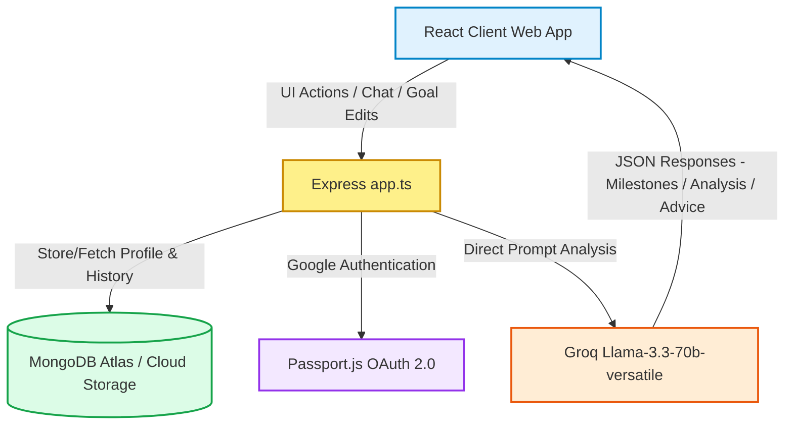

<div align="center">


#  Zohaib's Path
### *Empowering Careers through AI-Driven Navigation, Skills Evaluation & Dynamic Roadmaps*

[](https://react.dev)
[](https://tailwindcss.com)
[](https://groq.com)
[](https://www.mongodb.com/cloud/atlas)
[](LICENSE)

[**AI Studio Deployment**](https://ai.studio/apps/889da883-fec8-48d4-ae71-a7a8800be20a)  |  [**Report Bug**](https://github.com/zohaib-systems/Zohaib-s-Path/issues)  |  [**Request Feature**](https://github.com/zohaib-systems/Zohaib-s-Path/issues)
</div>

---

##  Welcome to Zohaib's Path

**Zohaib's Path** is a premium, state-of-the-art occupational navigator designed to solve the career-readiness gap. Driven by Llama-3.3-70b-versatile via Groq's high-speed inference, the platform analyzes technical skillsets, targets aspiring career roles, performs rich gap analyses, designs educational roadmaps, and provides an immersive career guidance console. It features full Google OAuth authentication and Cloud Synchronization using MongoDB Atlas, making it a cohesive, personalized companion for professional growth.

---

##  Key Features

### 1.  Interactive Skill Profiler & Career Goals
*   **Skill Matrices:** Rate and organize your technical skills by category (e.g., Frontend, Backend, DevOps) and watch levels animate dynamically.
*   **Aspiring Goals:** Set your future target role (e.g., *Senior Software Architect*), define a realistic target completion date, and input custom aspiration logs.

### 2.  Occupational Psychology Assessment
*   **Soft Skills Audit:** A custom, interactive survey targeting critical workplace attributes.
*   **Recharts Diagnostics:** Dynamic visual radar charts displaying scores for:
    *   *Leadership*
    *   *Collaboration*
    *   *Innovation*
    *   *Resilience*
    *   *Analytical Aptitude*
*   **Psychologist Report:** Instantly compiles an analytical markdown evaluation profile written from the perspective of an expert occupational psychologist.

### 3.  Skill Gap Analysis & Recommendations
*   **Intelligent Gap Analysis:** Evaluates your technical skill matrices against your desired future role, pinpointing knowledge and certification gaps.
*   **Targeted Course Recommendations:** Recommends specialized, top-tier online courses matching your experience level to bridge your career pathways.

### 4.  Dynamic Roadmap Engine
*   **Visual Milestones:** Automatically constructs a chronological step-by-step milestone path mapped to your career target dates.
*   **Tech Stack Mapping:** Each milestone specifies its deadline, recommended technologies to study, actionable learning tasks, and active status tracking (`Pending`, `In-Progress`, or `Completed`).

### 5.  AI Career Counselor Chat
*   **Llama 3.3 Core:** A context-aware chatbot trained on career strategic mentoring.
*   **Actionable Advisory:** Get advice on resumes, portfolios, salary negotiation, system architecture paradigms, and target study patterns.

### 6.  Multi-Device Cloud Sync
*   **Google OAuth 2.0:** Secure authorization using Passport.js.
*   **Mongo Store Persistence:** Securely syncs your career goals, active roadmap milestones, chat histories, psychologist scores, and skill levels across all devices.

---

##  Architecture & Flow



---

##  Technology Stack

| Layer | Technologies & Frameworks |
|---|---|
| **Frontend** | React 19, TypeScript, Vite, Tailwind CSS v4, Lucide React, Recharts |
| **Animation** | Motion (Framer Motion engine) for hardware-accelerated micro-animations |
| **Backend**| Node.js, Express, Passport.js, Express Session |
| **Database** | MongoDB Atlas, Mongoose ODM, connect-mongo (Session Store), Better-SQLite3 |
| **AI Client** | Groq SDK (Model: `llama-3.3-70b-versatile`) |

---

##  Local Installation & Setup

### Prerequisites
*   [Node.js](https://nodejs.org) (v18 or higher recommended)
*   A [MongoDB Atlas](https://www.mongodb.com/cloud/atlas) free tier cluster (or local MongoDB daemon)
*   A [Groq API Key](https://console.groq.com/)
*   A [Google Cloud Console](https://console.cloud.google.com/) Project for Google OAuth Credentials

### 1. Clone & Install Dependencies
```bash
git clone https://github.com/zohaib-systems/Zohaib-s-Path.git
cd Zohaib-s-Path
npm install
```

### 2. Configure Environment Variables
Create a `.env` (or `.env.local` for development environments) file in the root directory. Fill in your credentials matching the schema below:
```env
# Groq AI Service Key (Required for Career Chat & Roadmap engines)
GROQ_API_KEY="gsk_your_groq_api_key_goes_here"

# MongoDB Atlas Connection URI (Required for persistent cloud syncing)
MONGODB_URI="mongodb+srv://<username>:<password>@cluster0.abcde.mongodb.net/zohaibspath?retryWrites=true&w=majority"

# Google Cloud OAuth 2.0 Credentials (Required for secure sync)
GOOGLE_CLIENT_ID="your-google-client-id.apps.googleusercontent.com"
GOOGLE_CLIENT_SECRET="GOCSPX-your-google-client-secret"

# Session Encryption Key
SESSION_SECRET="your-highly-secure-custom-session-cookie-secret"

# Active Application Base URL
APP_URL="http://localhost:3000"
```

### 3. Run Development Server
Start the Express server bundled with the Vite middleware:
```bash
npm run dev
```
Open **[http://localhost:3000](http://localhost:3000)** in your browser.

---

##  Production Deployment

### Building the Frontend Bundle
To build the optimized static assets:
```bash
npm run build
```
This generates the SPA distribution files in `/dist`.

### Running Production Server
To spin up the production Node.js process:
```bash
npm start
```
The server will automatically serve the production build statically from `/dist` while exposing API endpoints.

---

##  API Documentation & Routes

| Endpoint | Method | Auth | Description |
|---|---|---|---|
| `/auth/google` | `GET` | None | Triggers Google OAuth callback initiation |
| `/auth/google/callback` | `GET` | None | Secure Passport redirection callback and session establishment |
| `/api/status` | `GET` | None | Checks MongoDB connection status and available integrations |
| `/api/me` | `GET` | User | Fetches active authenticated user profile details |
| `/api/logout` | `POST` | User | Destroys active Passport user session |
| `/api/user/sync` | `POST` | User | Synchronizes all telemetry (skills, goals, chat history, roadmap, scores) |
| `/api/user/profile` | `POST` | User | Updates primary profile (name, current job title, learning hours) |
| `/api/user/skills` | `POST` | User | Persists user skills array into cloud database |
| `/api/user/goals` | `POST` | User | Updates primary and secondary career target milestones |
| `/api/user/chat` | `POST` | User | Appends and saves chat conversational transcripts |
| `/api/user/psych` | `POST` | User | Saves psychological audit scores and professional report |
| `/api/user/reset` | `POST` | User | Clear all cloud profile telemetry and reset sandbox to factory defaults |

---

##  Troubleshooting & Configuration Tips

### 1.  MongoDB Atlas Connection Failures
*   **Special Characters in Password:** If your database password contains characters like `@`, `#`, or `$`, the connection string parser will throw authentication errors.
*   *Solution:* URL-encode special characters (e.g., replace `@` with `%40`, `#` with `%23`, and `$` with `%24`).
*   **IP Whitelisting:** If your environment changes, Atlas will drop connections.
*   *Solution:* Navigate to Network Access in MongoDB Atlas console, add a new entry, and choose **Allow Access from Anywhere** (`0.0.0.0/0`) during development.

### 2.  Google Sign-In Issues: `Error 400: redirect_uri_mismatch`
*   Ensure that the callback URL configured in the Google Cloud Console matches your `APP_URL` exactly:
*   *Authorized Redirect URI:* `http://localhost:3000/auth/google/callback`
*   *Authorized JavaScript Origin:* `http://localhost:3000`

---

##  License
Distributed under the MIT License. See [LICENSE](LICENSE) for more details.

---

<div align="center">
<p>Crafted with ❤️ for ambitious professionals mapping their destiny.</p>
<b><a href="#-zohaib's-path">Back to Top</a></b>
</div>
